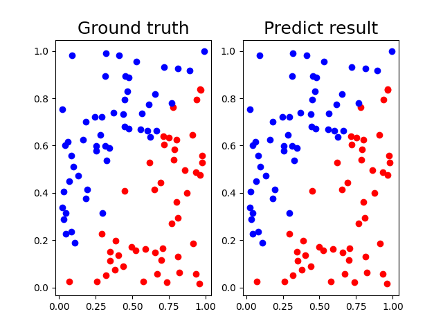
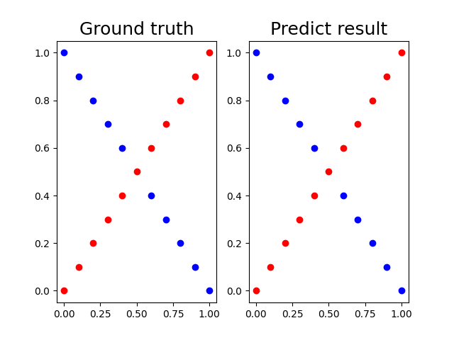
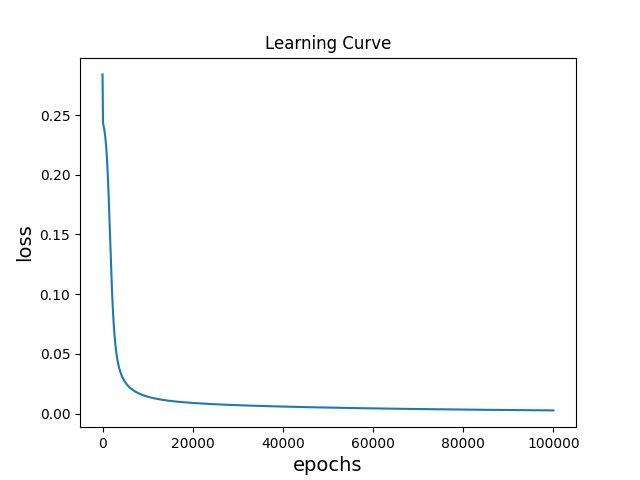
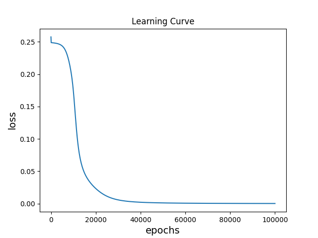

# Lab 1 — Results

## Key Metrics
| Metric | Value |
|--------|-------|
| Linear data accuracy | 100.00% |
| Linear data loss | 0.00261 |
| XOR data accuracy | 100.00% |
| XOR data loss | 0.00026 |
| Hidden units comparison final loss | hidden_units = 4 收斂接近 0 |

## Result Figures

## What the Results Show
- Linear 與 XOR 測試結果都達到 100.00% accuracy，代表模型能正確分開兩組資料。
- XOR 的測試 loss 約 0.00026，低於 Linear 的 0.00261，最後預測值非常接近 0 或 1。
- hidden_units = 4、10、100 都能下降，但較小的 hidden_units = 4 仍可收斂到接近 0 的 loss。
