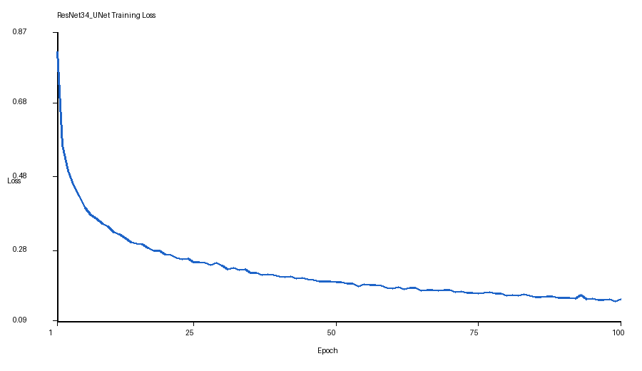

# Lab 2 — Results

## Key Metrics
| Metric | Value |
|--------|-------|
| ResNet34_UNet training loss, epoch 1 | 0.8173 |
| ResNet34_UNet training loss, epoch 100 | 0.1475 |
| Best ResNet34_UNet training loss | 0.1432 at epoch 99 |
| Dice score | 報告文字未提供明確數值 |

## Result Figures

## What the Results Show
- ResNet34_UNet 的 training loss 從 0.8173 降到 0.1475，最低點出現在 epoch 99。
- 報告文字描述 ResNet34_UNet 早期學得較快、分數較穩定，但沒有提供可摘錄的 Dice score 數字。
- Lab 2 目錄中沒有找到 PDF report；此檔案依可用的文字報告與 training loss 檔整理。
