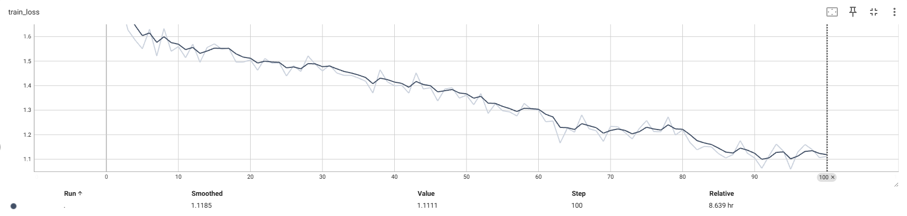
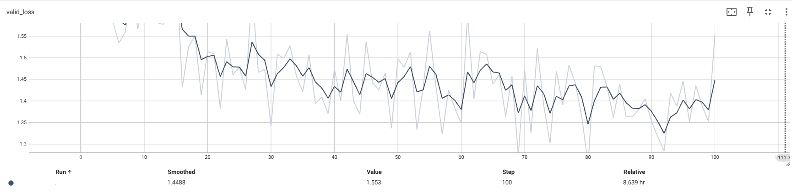
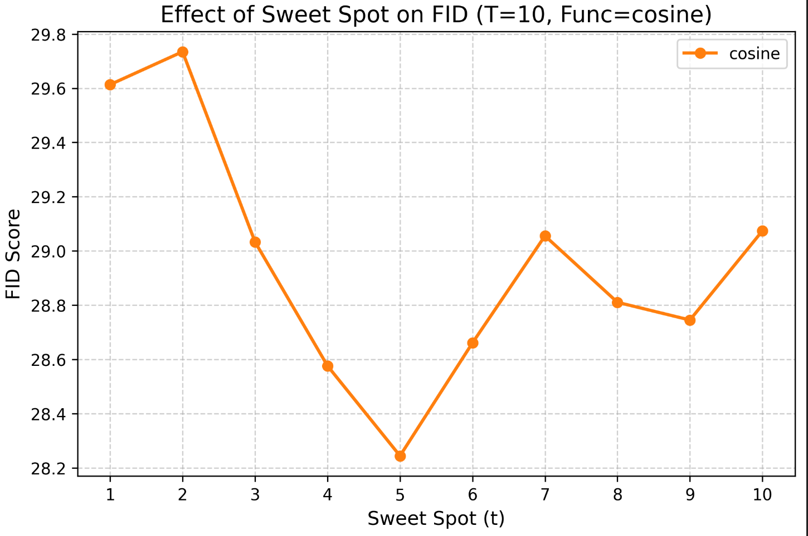
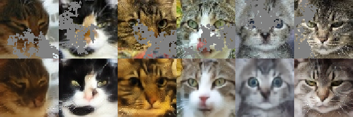

# Lab 3 — Results

## Key Metrics
| Metric | Value |
|--------|-------|
| Best FID Score | 28.24 |
| Cosine schedule FID | 28.24 |
| Linear schedule FID | 29.22 |
| Square schedule FID | 28.41 |
| Best setting | T = 10, sweet spot = 5, cosine schedule |

## Result Figures

## What the Results Show
- Cosine schedule 的 FID = 28.24，是三種 mask scheduling function 中最低的結果。
- Square schedule 的 FID = 28.41，接近 cosine；Linear schedule 的 FID = 29.22，表現最差。
- sweet spot = 5 時得到最低 FID，報告指出 sweet spot 不是越大越好。
