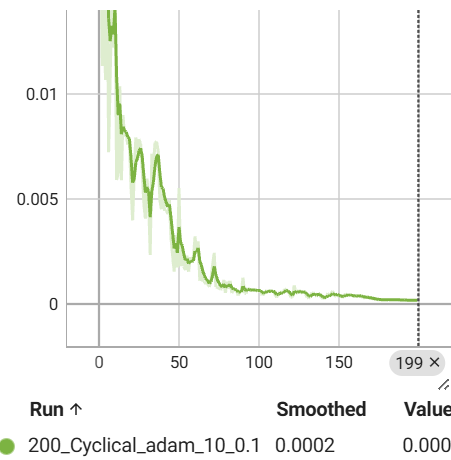
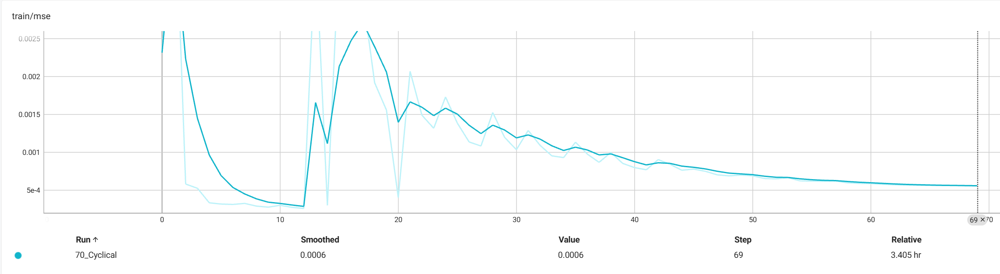
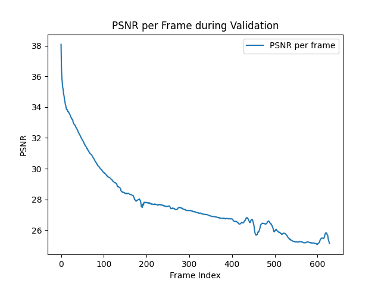
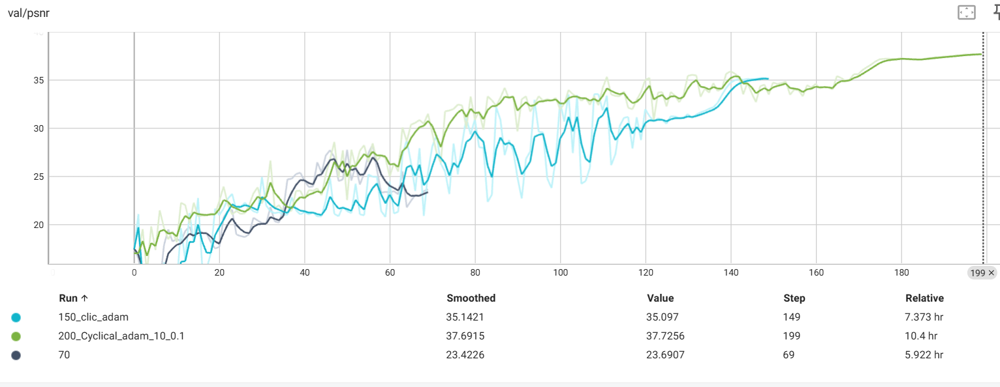

# Lab 4 — Results

## Key Metrics
| Metric | Value |
|--------|-------|
| Final validation PSNR, 70 epochs | 約 23.7 dB |
| Final validation PSNR, 150 epochs | 約 35.1 dB |
| Final validation PSNR, 200 epochs | 約 37.7 dB at epoch 199 |
| 200-epoch Cyclical final MSE loss | 約 0.0002 |
| Cyclical KL peak / final MSE | 約 180 / 約 0.0006 |
| Monotonic KL peak / final MSE | 約 55 / 約 0.0005 |
| No KL annealing KL peak / final MSE | 約 11 / 約 0.0007 |
| Long teacher-forcing protection final PSNR | 約 33.7 dB |

## Result Figures

## What the Results Show
- 訓練越久 PSNR 明顯越高：70 epochs 約 23.7 dB，150 epochs 約 35.1 dB，200 epochs 約 37.7 dB。
- 在 70-epoch KL annealing 比較中，Monotonic 的 final MSE 約 0.0005，是三者最低。
- 較長 teacher forcing 保護期最後只到約 33.7 dB，低於 200-epoch 設定的約 37.7 dB。
