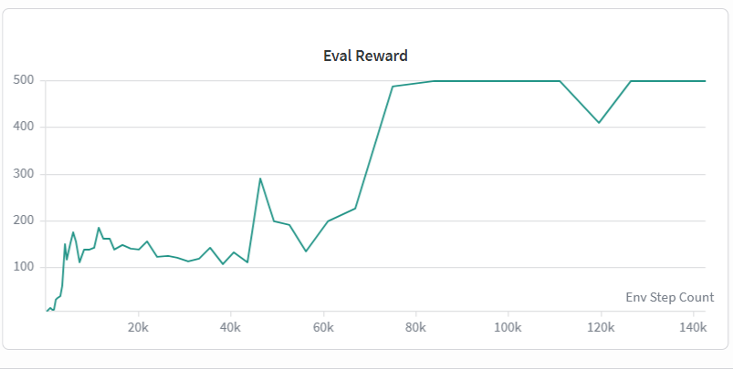
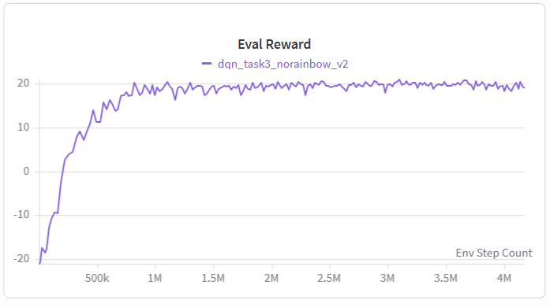
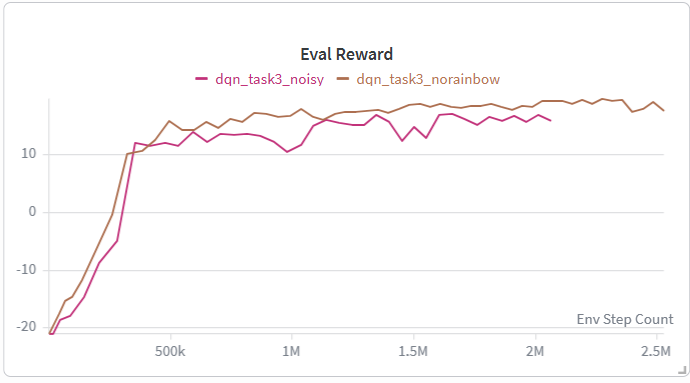
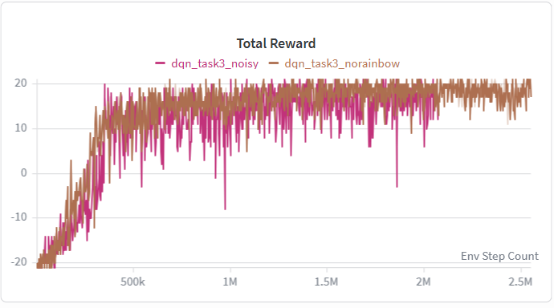

# Lab 5 — Results

## Key Metrics
| Metric | Value |
|--------|-------|
| Task 1 CartPole average score, 20 episodes | 500.00 / 500 |
| Task 1 eval reward threshold | 約 80k steps 突破 480 |
| Task 2 Pong Vanilla DQN average score, 20 episodes | 19.40 / 21 |
| Task 2 convergence scale | 約 2M+ steps 開始穩定 |
| Task 3 Pong Enhanced DQN average score, 20 episodes | 19.15 / 21 |
| Task 3 convergence scale | 約 1M steps 達到約 18-20 eval reward |
| Task 3 600k checkpoint average score | 18.75 / 21 |
| Noisy Linear final eval reward | 約 13-15 |
| Epsilon-greedy final eval reward | 約 18-20 |

## Result Figures

## What the Results Show
- Task 1 達到滿分 500.00 / 500，且約 80k steps 就突破 eval reward 480。
- Task 3 的 Enhanced DQN 約 1M steps 就穩定到 18-20，比 Task 2 Vanilla DQN 約 2M+ steps 更有效率。
- 最終 20-episode 平均分數中，Task 2 為 19.40 / 21，Task 3 為 19.15 / 21，兩者接近但 Task 3 收斂較快。
