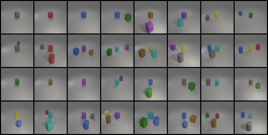
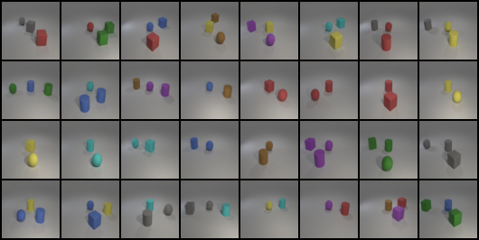
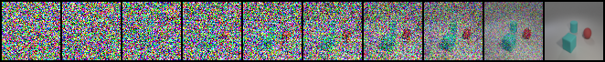
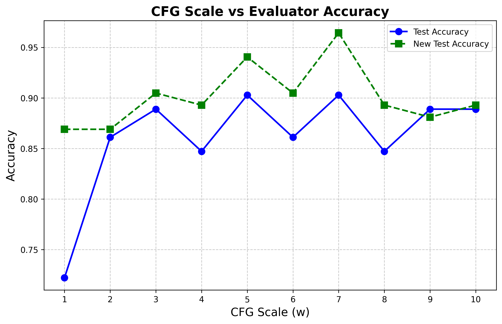

# Lab 6 — Results

## Key Metrics
| Metric | Value |
|--------|-------|
| Test set accuracy | 0.88 |
| New test set accuracy | 0.90 |
| Evaluation checkpoint | ddpm_epoch_200.pth |
| CFG scale | 3.0 |
| Test set condition count | 32 |
| New test set condition count | 32 |

## Result Figures

## What the Results Show
- 使用 epoch 200 權重與 cfg_scale = 3.0 時，test accuracy 達到 0.88。
- new_test accuracy 達到 0.90，比 test set 高 0.02。
- 兩組測試各 32 個條件，結果顯示模型在原測試條件與新測試條件上都有穩定表現。
